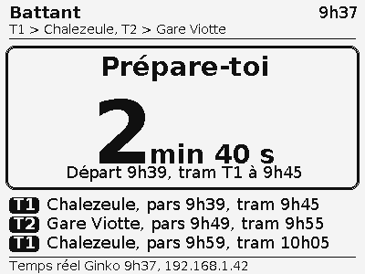
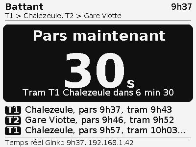

# Tram alerte

Un petit écran e-paper posé dans l'entrée qui dit, sans rien toucher, dans combien de temps
partir de chez soi pour attraper le prochain tram. Temps réel Ginko (Besançon) moins le temps
pour partir, verdict en trois états : "Tu as le temps", "Prépare-toi", "Pars maintenant".
Les passages trop proches pour être attrapés sont barrés, le verdict porte sur le premier tram
atteignable.

 

Inspiré du [Métronome](https://metronome.aywen.fr) d'Aywen (même écran, même câblage), avec un
décompte à la seconde, une configuration entièrement depuis le téléphone et aucun secret dans
le code.

## Matériel (45 à 55 euros)

| Pièce | Prix | Remarques |
|---|---|---|
| ESP32 DevKitC (WROOM-32, 30 ou 38 broches) | 10 à 17 euros | puce USB CP2102 ou CH340, les deux marchent sous Linux sans driver |
| Waveshare 4.2inch e-Paper Module **V2** (noir et blanc, 400x300) | 30 à 35 euros | la nappe 8 fils est fournie. Pas la version (B) ou (C) 3 couleurs, trop lente |
| Câble USB (données) et chargeur 5 V | récup | l'afficheur reste branché |
| Boîtier | impression 3D | voir [Boîtier](#boîtier) |

Câblage (SPI matériel de l'ESP32) :

| Écran | ESP32 |
|---|---|
| DIN | GPIO23 |
| CLK | GPIO18 |
| CS | GPIO33 |
| DC | GPIO25 |
| RST | GPIO26 |
| BUSY | GPIO27 |
| VCC | 3V3 |
| GND | GND |

Un module V1 (sans "V2" sur l'étiquette) se pilote avec `-DECRAN_V1` dans `build_flags`.

## Installation sur le poste

```bash
python3 -m venv --without-pip ~/.venvs/pio
curl -sSL https://bootstrap.pypa.io/get-pip.py | ~/.venvs/pio/bin/python -
~/.venvs/pio/bin/pip install platformio
export PATH=~/.venvs/pio/bin:$PATH
sudo usermod -aG dialout $USER   # une fois, puis se reconnecter : accès au port série
```

```bash
pio test -e native                          # scénarios de la logique de départ
pio run -e sim && ./.pio/build/sim/program  # rend chaque écran dans sim/out/*.png
pio run -e esp32dev                         # compile le firmware
pio run -e esp32dev -t upload               # téléverse (ESP32 branché en USB)
pio device monitor                          # logs série à 115200 bauds
```

Les polices sont générées depuis DejaVu avec `tools/fontconvert.py` (freetype-py dans le venv) :

```bash
pip install freetype-py
python tools/fontconvert.py /usr/share/fonts/truetype/dejavu/DejaVuSans-Bold.ttf 15 Titre20 32 255 > src/polices/Titre20.h
```

## Premier démarrage

1. L'écran affiche un QR code Wi-Fi : le scanner (réseau `TramAlerte`, mot de passe `tram1234`)
   et choisir sa box dans le portail qui s'ouvre.
2. L'écran affiche un second QR code avec l'adresse de l'afficheur sur le réseau
   (`http://192.168.x.x/`). La page demande :
   - la clé API Ginko : la clé d'essai du jour (lien sur la page, valable 24 h) ou une clé
     définitive demandée par mail à ginko.support-ssi@keolis.com (objet "Demande de clé API") ;
   - l'arrêt de départ (recherche par nom ou autour de soi) ;
   - les directions qui conviennent (plusieurs possibles, trams et bus) ;
   - le temps pour partir (chaussures et marche), la marge, la plage de nuit.
3. Enregistrer : l'afficheur passe en régime normal. La page reste accessible à la même
   adresse pour changer un réglage ou recoller une clé ; l'adresse est rappelée en bas de l'écran.

Appui de 3 s sur le bouton BOOT de l'ESP32 : le Wi-Fi est oublié et le portail revient.

## Comportement

- Ginko est interrogé toutes les 30 s (15 s quand le départ est à moins de 5 min), le
  décompte tourne localement entre deux réponses.
- Rafraîchissement partiel de l'écran dès que le texte change (secondes arrondies à 10 s en
  "prépare-toi" et "pars maintenant", minutes sinon), rafraîchissement complet toutes les 30 min
  et à chaque changement d'état.
- La nuit (23 h à 6 h par défaut), l'écran montre l'heure et le prochain passage connu, Ginko
  n'est interrogé que toutes les 10 min.
- Wi-Fi perdu, Ginko injoignable, clé refusée : la ligne du bas le dit, et le dernier verdict
  reste affiché avec l'heure de ses données.
- `http://<ip>/simuler?secondes=390,1500` fige l'afficheur sur des passages simulés (secondes
  avant le tram), `/simuler` sans paramètre revient au temps réel, `/etat` renvoie l'état en JSON.

## Algorithme

Pour chaque passage annoncé par `TR/getTempsLieu` :

```
tram  = tempsEnSeconde - (maintenant - heure de la réponse)
reste = tram - (tempsPourPartir + marge) * 60
```

| État | Condition |
|---|---|
| raté | `reste < 0` |
| pars maintenant | `0 <= reste < 1 min` |
| prépare-toi | `1 min <= reste < 4 min` |
| tu as le temps | au-delà |

Cette logique vit dans [src/depart.cpp](src/depart.cpp), sans dépendance Arduino, et
[test/test_depart](test/test_depart/test_depart.cpp) la vérifie en natif.

## Données et sécurité

- Temps réel [Ginko](https://api.ginko.voyage/) (Keolis Besançon Mobilités), licence ODbL.
  Une seule méthode côté firmware (`TR/getTempsLieu`, POST, TLS 1.2, racine ISRG Root X1
  épinglée). La page de configuration appelle Ginko directement depuis le téléphone pour la
  recherche d'arrêt et les directions.
- La clé API, le Wi-Fi, l'arrêt et les réglages sont dans la mémoire flash de l'ESP32
  (Preferences). Rien de tout cela n'est dans ce dépôt.
- La page de configuration est servie en HTTP sur le réseau local, sans authentification :
  n'importe qui sur le Wi-Fi de la maison peut la voir, clé comprise.

## Boîtier

Le module 4,2" V2 mesure 103 x 78,5 mm hors tout (zone active 84,8 x 63,6 mm). Modèles
imprimables existants :
[boîtier symétrique avec crochet mural](https://printables.com/model/214253-waveshare-42-e-paper-case-symmetrical-and-without-),
[cadre pour le module](https://www.printables.com/model/445651-waveshare-42-inch-e-paper-module-frame),
[station météo v2](https://printables.com/model/147936-new-42-e-paper-weather-station-v2-w-esp32-case/files).

## Organisation

```
platformio.ini        envs esp32dev (firmware), native (tests), sim (rendu PNG sur PC)
src/main.cpp          démarrage, boucle, cadences, bouton, simulation
src/depart.*          logique pure du verdict
src/ginko.*           client HTTPS Ginko
src/config.*          réglages en flash
src/portail.*         Wi-Fi (WiFiManager) et page de configuration (portail_page.h)
src/ecran.*           pilotage de l'e-paper (GxEPD2), QR codes
src/dessin.*          mise en page des écrans (Adafruit GFX), partagée avec le simulateur
src/polices/          polices GFX générées (DejaVu)
sim/                  simulateur : stubs Arduino, Adafruit GFX embarqué, écriture PNG
test/test_depart/     tests Unity
tools/fontconvert.py  génération des polices
```

Chaque push sur `main` compile tests, simulateur et firmware
([build.yml](.github/workflows/build.yml)), les PNG et le binaire sont en artefacts du run.
